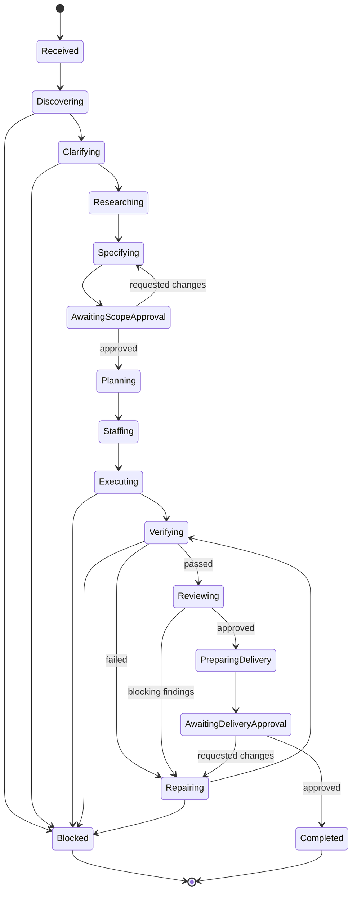

# Architecture

## System model

DevHarness separates the goal runtime from the mechanisms used to operate a particular repository.

```text
Developer
   |
   v
CLI / progress interface
   |
   v
Decision Surface
   +-> Alignment Brief / Decision Queue
   +-> Progress Pulse / Delivery Brief
   |
   v
Goal Runtime -----------------------------------+
   |                                            |
   +-> artifact store                           +-> policy and human gates
   +-> planner and team coordinator             +-> event log and recovery
   +-> verification and review controller       +-> budgets and retry limits
   |
   v
Agent Adapter
   |
   v
Portable Project Harness
   +-> platform packs
   +-> generated project adapter
   +-> isolated workspace and services
   +-> build, test, behavior verification
   +-> evidence collection
   |
   v
Consumer repository
```

The runtime owns process. The project harness owns proof mechanisms. Agent adapters own model/tool differences. Consumer repositories own their application code and tests.

Before a goal run, executable onboarding creates a revision-bound Claim Ledger. It compares
repository documentation, code, tests and runtime evidence without treating any one source as
infallible. Required frontend, backend, database, security, testing, deployment and automation
coverage is explicit. Missing or conflicting coverage becomes a blocker or capability request,
not an optimistic inference. See [Executable onboarding](onboarding-and-understanding.md).

## Goal state machine



Every transition emits an event and updates durable state. A run is resumable from artifacts and events, not from a model conversation buffer.

Developer attention is not a separate hidden conversation. The runtime publishes revision-bound interaction packets and records `attention.requested` or `attention.resolved` events. Most attention is orthogonal to state; policy pauses the run only at a human gate or when safe execution requires authority.

## Decision Surface

The Decision Surface compiles detailed artifacts into four portable interaction packets:

- `alignment-brief` for understanding and acceptance approval.
- `decision-queue` for one to three material exceptions.
- `progress-pulse` for no-action status.
- `delivery-brief` for delivery approval.

Packets are read models. They never replace goal state, gate decisions, source artifacts, criteria, evidence, or review verdicts. Each packet binds to a goal run and Git revision, maps surfaced items to checksummed artifacts, reports compression counts, and exposes drill-down actions.

The attention policy evaluates impact, unresolved uncertainty, and reversibility. Repository-discoverable facts and low-risk reversible choices remain autonomous. Outcome or scope changes, security/privacy/destructive/financial/external-authority boundaries, costly-to-reverse choices, and exhausted budgets require attention.

See [Developer interaction model](interaction-model.md) and the versioned `interaction-packet` schema.

## Durable artifacts

Each goal run has a stable identifier and an artifact manifest. Logical artifacts include:

```text
goal/
  intake.md
  questions.yaml
  research.md
  requirements.md
  design.md
  acceptance.yaml
  plan.yaml
  team.yaml
  decisions.jsonl
  events.jsonl
interaction/
  alignment-brief.json
  decision-queue/<packet-id>.json
  progress-pulse.json
  delivery-brief.json
tasks/
  <task-id>/contract.yaml
  <task-id>/result.yaml
verification/
  manifest.yaml
  criteria/<criterion-id>.yaml
  tests/
  screenshots/
  logs/
review/
  findings.yaml
delivery/
  report.md
  pull-request.yaml
```

These are logical contracts. Their physical storage is outside the consumer repository by default.

The detailed tree is not the default review surface. A developer normally reads the four interaction packets and opens source artifacts only for drill-down or audit.

## Acceptance criteria

Each criterion must define:

- Stable identifier.
- User- or system-observable claim.
- Priority and whether it blocks delivery.
- Proof method and responsible verifier capability.
- Required evidence types.
- Verdict: `pending`, `pass`, `fail`, `blocked`, or `not_applicable`.
- Evidence references and timestamp.

Example:

```yaml
id: AC-3
claim: A signed-in user can create a note and see it after a page reload.
blocking: true
proof:
  pack: web
  driver: playwright
  scenario: create-and-reload-note
evidence:
  required: [test-result, screenshot, network, database-state]
verdict: pending
```

## Dynamic agent team

The planner selects roles from required capabilities rather than always creating a fixed set of personas.

Common capabilities include:

- Repository discovery.
- Product clarification and research.
- Architecture and interface design.
- Frontend, backend, database, or infrastructure implementation.
- Test creation.
- Behavior verification.
- Security, accessibility, or performance review.
- Cross-task coordination.

Every assigned task has a contract:

```yaml
id: task-auth-api
goal: Add the password-reset request endpoint.
owner: agent-implementer-2
depends_on: [task-auth-design]
inputs: [requirements.md, design.md, AC-1, AC-2]
allowed_scope:
  - backend/auth/**
  - tests/auth/**
forbidden_scope:
  - database/migrations/**
outputs:
  - implementation diff
  - focused tests
done_when:
  - focused tests pass
  - task interface contract is satisfied
```

The coordinator owns dependency readiness, conflicts, task reassignment, integration order, and escalation. Implementers do not issue final verification verdicts for their own behavior-critical changes.

## Isolation model

Each run receives:

- An external Git worktree.
- A unique run identifier.
- Run-scoped ports, service names, databases, and temporary data where supported.
- Explicit filesystem boundaries.
- A cleanup lease and expiry policy.

Concurrent tasks may receive child worktrees or serialized ownership depending on their dependency and conflict graph. Parallelism is a planning decision, not a default.

The execution graph declares expected duration plus shared/exclusive path, data, schema,
database, service, port, workspace, environment and external-resource claims. The scheduler
optimizes the critical path within the agent budget and selects only dependency-ready,
non-conflicting tasks. One Integration Owner serializes final integration and cross-module
verification. See [Verification and parallel execution](verification-and-parallel-execution.md).

## System and strategy baselines

The system model traces user outcomes across components, trust boundaries, roles, persistent
entities, calls, writes and invariants. Database and security are part of that model rather
than optional review checklists. A developer-approved design and architecture strategy then
provides versioned consistency rules for frontend, backend, data, security and testing.
Agents may propose strategies or bounded exceptions but cannot approve or silently replace
them. See [System model and strategy](system-model-and-strategy.md).

## Verification depth

The portable verification policy separates unit, integration, functional, system, release,
performance and post-deploy proof. Feature completion requires its real surface—a browser,
simulator, CLI or equivalent—and complete dependency effects. Release readiness adds actual
deployment/migration/rollback automation, quantitative performance thresholds and a canary
where applicable. A command exit or CI status is only one evidence input.

## Extension interfaces

### Agent adapter

Normalizes agent-specific execution without changing engineering contracts:

- Capability discovery.
- Start, continue, interrupt, and cancel.
- Context and artifact delivery.
- Workspace/tool policy.
- Structured result and usage reporting.

### Platform pack

Provides reusable mechanisms for a project type:

- Detection signals.
- Readiness checks.
- Launch and teardown strategies.
- Test and verification drivers.
- Evidence collectors.
- Common failure diagnostics.

Initial packs: `web`, then `api` or `cli`.

### Generated project harness

Adapts a platform pack to one repository:

- Exact startup and health checks.
- Environment and secret requirements.
- Test users and seed/reset procedures.
- URLs, routes, API boundaries, and data stores.
- Project commands and quality gates.
- Forbidden actions and protected resources.
- Acceptance-proof recipes.

The generator interviews the repository first. It asks the developer only about facts that cannot be discovered safely.

### Research adapter

Provides source-aware web and documentation research. Research artifacts must record citations, retrieval time, adopted decisions, and unresolved uncertainty.

### VCS adapter

Provides branches, commits, diffs, pull requests, review comments, and CI status. GitHub is the first planned provider.

## Repair and review loops

A failed criterion produces a structured repair assignment containing:

- Failed claim.
- Evidence and reproduction information.
- Suspected scope, without asserting an unproven root cause.
- Previously attempted repairs.
- Attempt and budget limits.

The runtime stops and reports a blocker when limits are exhausted, required authority is missing, the approved scope must change materially, or the project lacks a required proof capability.

## Security and trust boundaries

- Secrets are references supplied at runtime, never copied into goal artifacts.
- Web research is untrusted input and cannot directly modify policy or execute commands.
- Repository instructions are scoped and provenance-recorded.
- Agent tool access is least-privilege per task.
- Destructive actions require explicit policy and, by default, human approval.
- Evidence is generated by a sealed, code-owned driver registry and signed by a pinned Supervisor identity.
- Legacy execution receipts are integrity inputs, not authority; only verified Supervisor manifests can promote readiness.
- Human gates begin with a signed pending request and end with an immutable signed receipt bound to run, repository, relevant HEAD, subject hash, nonce and expiry.
- Approval works only through the Supervisor-owned foreground TTY. JSON, pipes, self-declared human fields and boolean gate flags cannot approve.
- The Supervisor key, state root, environment and control channel must be absent from worker sandboxes. Until that isolation is proved, `supervisor-isolation` blocks readiness.
- Framework updates and third-party packs are version-pinned for reproducibility.

See [Supervisor provenance and human gates](supervisor-provenance.md).
